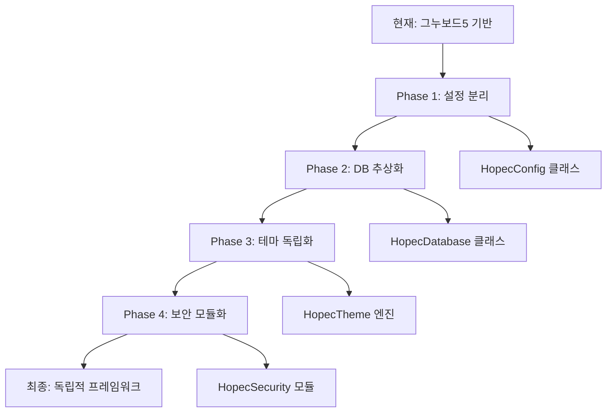

# HOPEC 프로젝트 그누보드 의존성 분석 보고서

## 🎯 분석 목적
HOPEC 프로젝트에서 그누보드5와 관련된 모든 코드를 식별하고 의존성을 분석하여 재사용성 향상 방안을 도출

---

## 📊 그누보드 관련 코드 전체 현황

### 1. 🏗️ 핵심 설정 파일들

#### A. 메인 설정 파일
- **`config.php`** - 그누보드5 핵심 상수 정의
  ```php
  define('G5_VERSION', '그누보드5');
  define('G5_GNUBOARD_VER', '5.3.2.3');
  define('_GNUBOARD_', true);
  ```

#### B. 공통 파일들
- **`common.php`** - 그누보드 초기화 및 보안 설정
- **`_common.php`** - 경량화된 공통 변수 설정
- **`lib/common.lib.php`** - 그누보드 함수 라이브러리 (경량화 버전)

#### C. 호환성 레이어
- **`mysql_compat.php`** - PHP 8.4 MySQL 함수 호환성
- **`compat_php8.php`** - PHP 8 호환 폴리필

---

### 2. 🔧 그누보드 상수 (G5_*) 사용 현황

#### A. 경로 관련 상수
```php
// 디렉토리 경로
G5_PATH, G5_URL, G5_DOMAIN, G5_HTTPS_DOMAIN
G5_ADMIN_DIR, G5_BBS_DIR, G5_CSS_DIR, G5_DATA_DIR
G5_THEME_DIR, G5_THEME_PATH, G5_THEME_URL
G5_LIB_DIR, G5_PLUGIN_DIR, G5_SKIN_DIR

// 파일 경로 
G5_DATA_PATH, G5_SESSION_PATH, G5_EDITOR_PATH
G5_CSS_URL, G5_JS_URL, G5_IMG_URL
```

#### B. 시스템 설정 상수
```php
// 시간 관련
G5_SERVER_TIME, G5_TIME_YMDHIS, G5_TIME_YMD, G5_TIME_HIS

// 보안 관련
G5_STRING_ENCRYPT_FUNCTION, G5_ESCAPE_FUNCTION
G5_DISPLAY_SQL_ERROR

// 데이터베이스
G5_MYSQLI_USE, G5_MYSQL_SET_MODE

// 기타 설정
G5_USE_CACHE, G5_COOKIE_DOMAIN, G5_SET_TIME_LIMIT
```

#### C. 파일 및 기능 상수
```php
// 파일 관련
G5_FILE_PERMISSION, G5_DIR_PERMISSION
G5_THUMB_JPG_QUALITY, G5_THUMB_PNG_COMPRESS

// 게시판 관련
G5_LINK_COUNT

// 입력값 검사
G5_ALPHAUPPER, G5_ALPHALOWER, G5_ALPHABETIC
G5_NUMERIC, G5_HANGUL, G5_SPACE, G5_SPECIAL
```

---

### 3. 🗄️ 데이터베이스 의존성

#### A. 그누보드 전역 변수 ($g5)
```php
$g5['connect_db']     // 데이터베이스 연결
$g5['member_table']   // 회원 테이블
$g5['board_table']    // 게시판 테이블  
$g5['config_table']   // 설정 테이블
$g5['write_prefix']   // 게시물 테이블 접두사
$g5['lo_location']    // 위치 정보
$g5['lo_url']         // URL 정보
```

#### B. 데이터베이스 함수들
```php
// 연결 관리
sql_connect(), sql_select_db(), sql_set_charset()

// 쿼리 실행
sql_query(), sql_fetch(), sql_fetch_array()

// 기타 함수
sql_insert_id(), sql_num_rows(), sql_free_result()

// 보안 함수
sql_escape_string()
```

---

### 4. 🎨 테마 시스템 의존성

#### A. Natural Green 테마 구조
```
theme/natural-green/
├── bootstrap.php         # 그누보드 테마 초기화
├── head.php             # 그누보드 헤더 통합
├── tail.php             # 그누보드 푸터 통합
├── index.php            # 테마 메인 페이지
├── config/              # 테마 설정
├── skin/board/          # 그누보드 게시판 스킨
└── includes/            # 테마 컴포넌트
```

#### B. 그누보드 스킨 시스템
```php
// 게시판 스킨 경로
$board_skin_path = get_skin_path('board', $board['bo_skin']);
$member_skin_path = get_skin_path('member', $config['cf_member_skin']);
$new_skin_path = get_skin_path('new', $config['cf_new_skin']);
```

---

### 5. 📋 게시판 시스템 의존성

#### A. 게시판 템플릿 시스템
- **`board_templates/`** 폴더 전체
- 그누보드 게시판 구조와 밀접하게 연관
- `hopec_posts` 테이블 어댑터 사용

#### B. 관리자 시스템 연동
- **`admin/posts/`** - 게시물 관리
- **`admin/boards/`** - 게시판 관리
- 그누보드 테이블 구조 의존

---

### 6. 🔐 보안 및 세션 의존성

#### A. 세션 관리
```php
// 그누보드 세션 설정
session_save_path(G5_SESSION_PATH);
$_SESSION['ss_mb_id'] // 그누보드 회원 세션
```

#### B. 보안 함수들
```php
// XSS 방지
clean_xss_tags()

// SQL 인젝션 방지  
sql_escape_string()

// 입력값 필터링
get_search_string()
```

---

### 7. 📁 파일별 의존성 상세 분석

#### A. 높은 의존성 (그누보드 핵심 기능 사용)
```
🔴 HIGH DEPENDENCY
├── common.php              # 그누보드 초기화 전체
├── config.php              # 그누보드 상수 정의
├── lib/common.lib.php      # 그누보드 함수 라이브러리
├── mysql_compat.php        # MySQL 호환성
├── sitemap.php             # 그누보드 테이블 직접 접근
├── g4_import*.php          # 그누보드 마이그레이션
└── theme/natural-green/    # 그누보드 테마 시스템
    ├── bootstrap.php
    ├── head.php
    ├── tail.php
    └── skin/board/
```

#### B. 중간 의존성 (일부 그누보드 기능 사용)
```
🟡 MEDIUM DEPENDENCY  
├── index.php               # 그누보드 초기화만 사용
├── head.sub.php            # 템플릿 헬퍼 로드
├── includes/
│   ├── template_helpers.php # 설정 파일 로드
│   ├── DatabaseManager.php  # 그누보드 연결 사용
│   └── popup/popup-engine.php # 일부 그누보드 함수
├── board_templates/        # 게시판 어댑터
└── admin/mvc/              # 일부 모델에서 사용
```

#### C. 낮은 의존성 (최소한의 그누보드 기능만 사용)
```
🟢 LOW DEPENDENCY
├── _common.php             # 기본 상수만 정의
├── includes/
│   ├── SecurityManager.php
│   ├── MenuManager.php  
│   └── SimpleColorOverride.php
├── admin/mvc/controllers/  # 대부분 독립적
├── admin/mvc/services/     # 독립적 서비스들
└── config/                 # 모듈별 설정
```

---

## 🔄 의존성 제거 전략

### Phase 1: 설정 시스템 분리 🎯
```php
// 현재 (그누보드 의존)
define('G5_PATH', __DIR__);
define('G5_URL', 'http://hopec.local:8012');

// 목표 (독립적 설정)
class HopecConfig {
    const BASE_PATH = __DIR__;
    const BASE_URL = 'http://hopec.local:8012';
}
```

### Phase 2: 데이터베이스 레이어 분리 🗄️
```php
// 현재 (그누보드 함수)
sql_query("SELECT * FROM {$g5['member_table']}");

// 목표 (독립적 DB 클래스)
$db = new HopecDatabase();
$db->query("SELECT * FROM members");
```

### Phase 3: 테마 시스템 독립화 🎨
```php
// 현재 (그누보드 테마)
include G5_THEME_PATH.'/head.php';

// 목표 (독립적 테마)
$theme = new HopecTheme('natural-green');
$theme->renderHeader();
```

### Phase 4: 보안 시스템 모듈화 🔐
```php
// 현재 (그누보드 보안)
$escaped = sql_escape_string($input);

// 목표 (독립적 보안)
$security = new HopecSecurity();
$escaped = $security->escapeString($input);
```

---

## 📋 변환 우선순위

### 🔴 즉시 처리 필요 (Critical)
1. **설정 시스템** - 모든 G5_ 상수 제거
2. **데이터베이스 레이어** - sql_* 함수 대체
3. **공통 함수 라이브러리** - 독립적 유틸리티로 변환

### 🟡 단계적 처리 (High Priority)
4. **테마 시스템** - 그누보드 테마 구조에서 분리
5. **게시판 시스템** - 독립적 게시판 엔진 구축
6. **회원 시스템** - 그누보드 회원 구조에서 분리

### 🟢 점진적 개선 (Medium Priority)  
7. **관리자 시스템** - 그누보드 의존성 최소화
8. **파일 업로드** - 독립적 파일 관리 시스템
9. **캐싱 시스템** - 그누보드 캐시에서 분리

---

## 🛠️ 구체적 변환 계획

### 1. 설정 클래스 생성
```php
class HopecConfig {
    // 경로 설정
    const BASE_PATH = __DIR__;
    const THEME_PATH = self::BASE_PATH . '/themes';
    const UPLOAD_PATH = self::BASE_PATH . '/uploads';
    
    // 데이터베이스 설정
    const DB_HOST = 'localhost';
    const DB_NAME = 'hopec';
    
    // 보안 설정
    const ENCRYPT_METHOD = 'password_hash';
    const ESCAPE_METHOD = 'prepared_statements';
}
```

### 2. 데이터베이스 추상화 레이어
```php
class HopecDatabase {
    private $pdo;
    
    public function query($sql, $params = []) {
        $stmt = $this->pdo->prepare($sql);
        $stmt->execute($params);
        return $stmt;
    }
    
    public function fetch($sql, $params = []) {
        return $this->query($sql, $params)->fetch();
    }
}
```

### 3. 테마 엔진 독립화
```php
class HopecTheme {
    private $themeName;
    private $templatePath;
    
    public function render($template, $data = []) {
        extract($data);
        include $this->templatePath . '/' . $template . '.php';
    }
}
```

---

## 📊 예상 작업량

### 파일 수정 범위
- **전체 수정 필요**: 15개 파일
- **부분 수정 필요**: 25개 파일  
- **새로 생성 필요**: 10개 클래스

### 예상 소요 시간
- **Phase 1 (설정)**: 1주
- **Phase 2 (DB)**: 2주
- **Phase 3 (테마)**: 3주  
- **Phase 4 (보안)**: 1주
- **테스트 및 검증**: 1주

**총 예상 기간**: 8주

---

## ⚠️ 주의사항 및 리스크

### 호환성 리스크
1. **기존 데이터 호환성** - 그누보드 테이블 구조 변경 시 데이터 마이그레이션 필요
2. **플러그인 호환성** - 그누보드 플러그인들과의 호환성 상실
3. **업데이트 경로** - 그누보드 업데이트 혜택 상실

### 기술적 리스크  
1. **성능 저하** - 추상화 레이어로 인한 성능 오버헤드
2. **복잡성 증가** - 독립적 시스템 구축으로 인한 복잡도 상승
3. **유지보수 부담** - 그누보드 커뮤니티 지원 상실

### 권장 접근법
1. **점진적 마이그레이션** - 한 번에 모든 의존성을 제거하지 말고 단계적 진행
2. **하위 호환성 유지** - 기존 기능이 중단되지 않도록 호환성 레이어 유지
3. **충분한 테스트** - 각 단계별 철저한 테스트와 검증

---

## 📈 마이그레이션 로드맵



이 분석을 바탕으로 체계적으로 그누보드 의존성을 제거하여 재사용 가능한 독립적인 프레임워크로 변환할 수 있습니다.